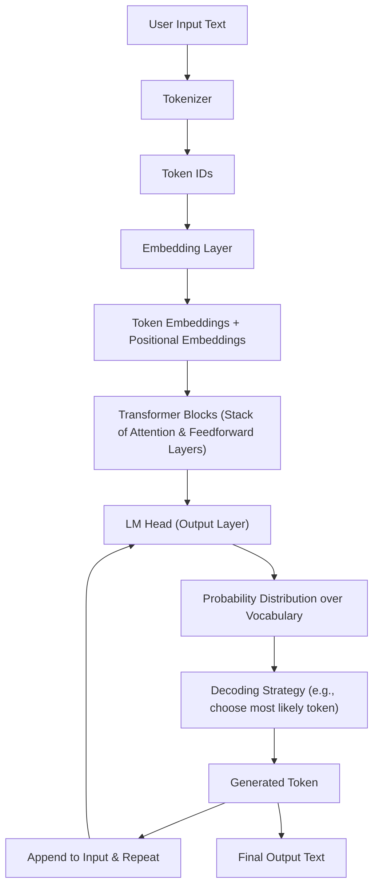

```mermaid
flowchart TD
    A["User Input Text"] --> B["Tokenizer"]
    B --> C["Token IDs"]
    C --> D["Embedding Layer"]
    D --> E["Token Embeddings + Positional Embeddings"]
    E --> F["Transformer Blocks (Stack of Attention & Feedforward Layers)"]
    F --> G["LM Head (Output Layer)"]
    G --> H["Probability Distribution over Vocabulary"]
    H --> I["Decoding Strategy (e.g., choose most likely token)"]
    I --> J["Generated Token"]
    J --> K["Append to Input & Repeat"]
    K --> G
    J --> L["Final Output Text"]
```