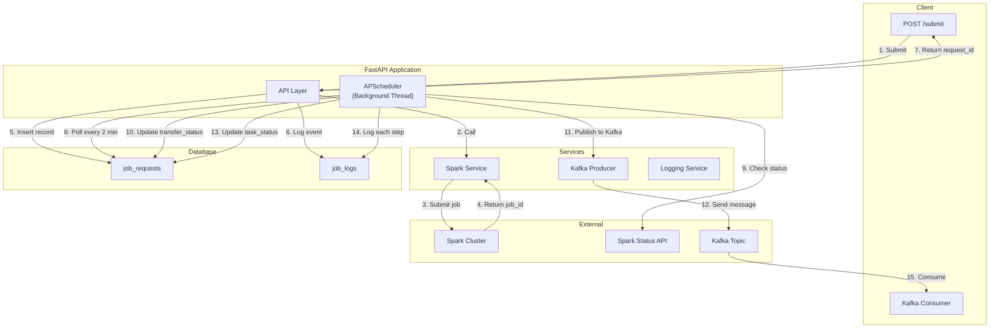
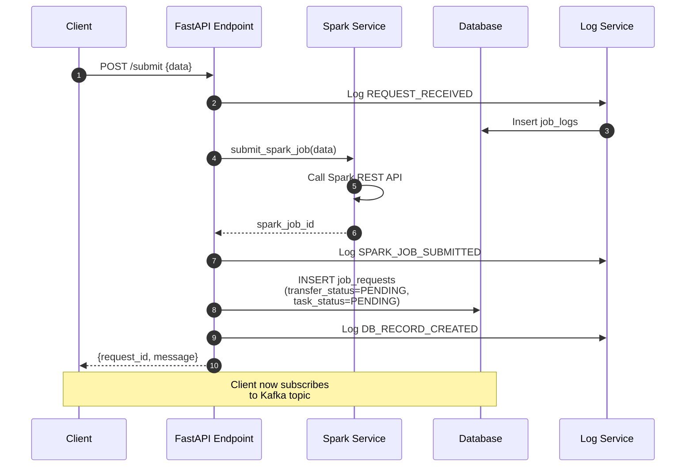
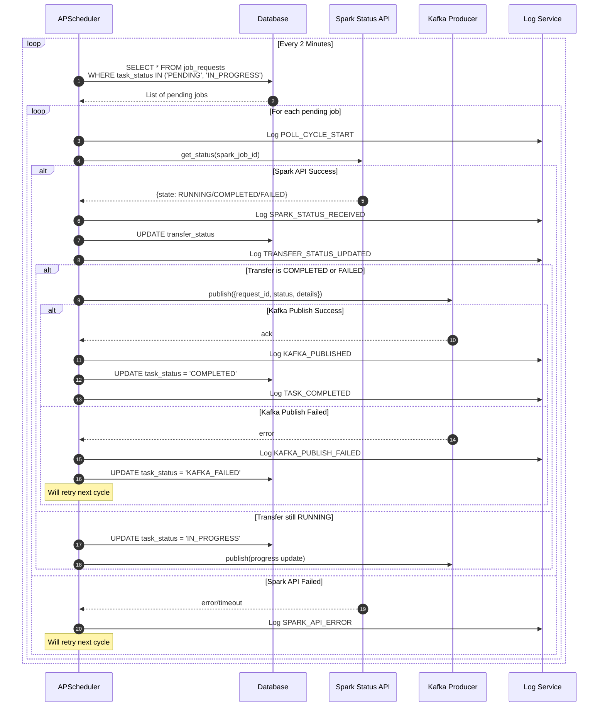
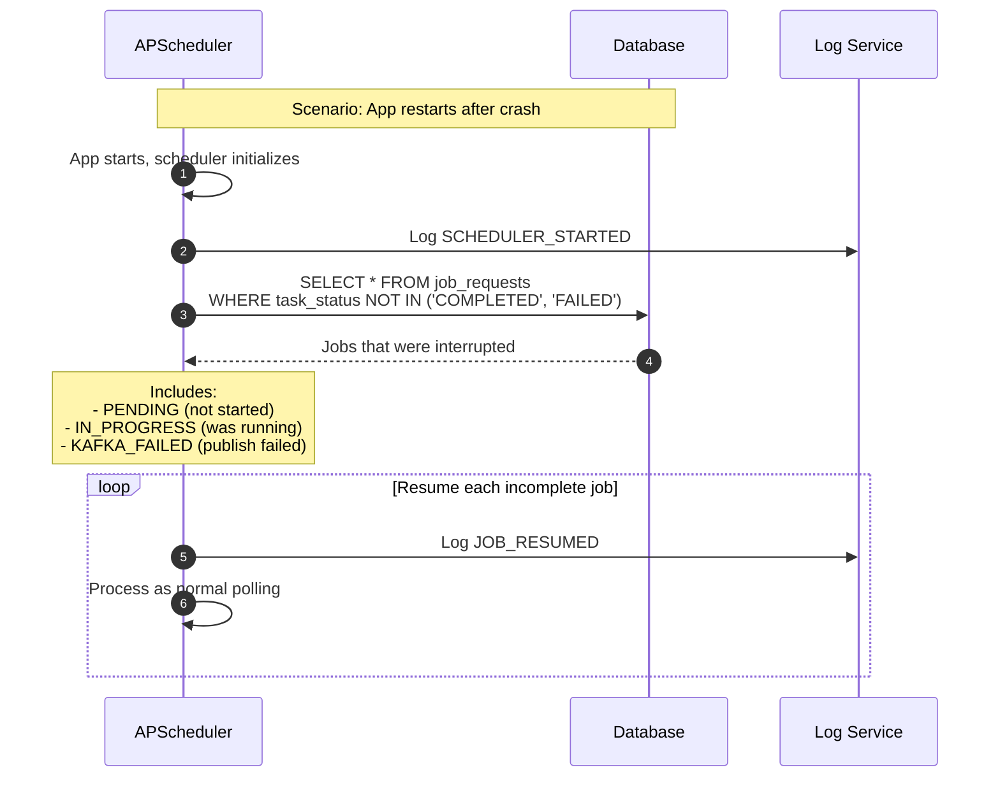
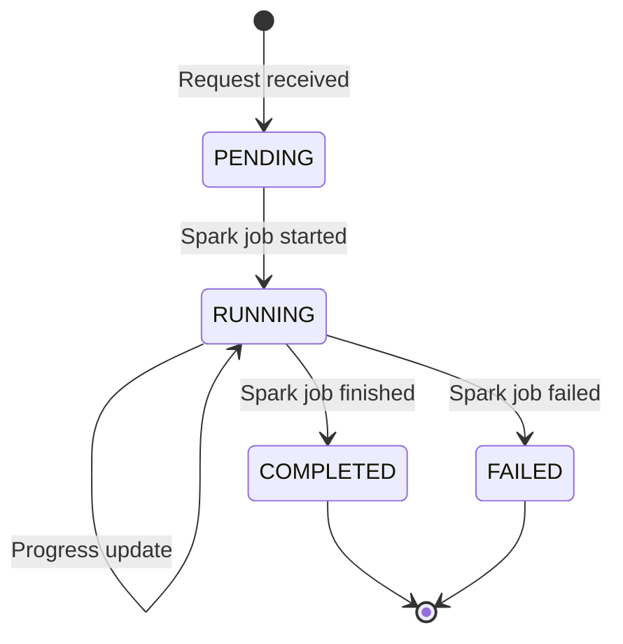
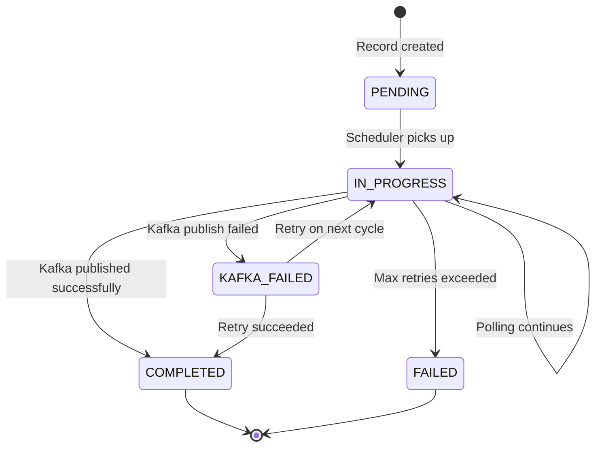

# Async Job Processing System - Implementation Plan

## Overview

Build an asynchronous job processing system where:

1. **POST API** receives requests, triggers Spark jobs, and returns `request_id` immediately
2. **APScheduler** runs alongside FastAPI, polling for pending jobs every 2 minutes
3. **Dual-status tracking** ensures both transfer completion AND Kafka publish success
4. **Kafka producer** publishes status updates for consumers to poll
5. **Audit logging** tracks every step for production debugging

---

## Architecture Diagram

---

## Sequence Diagrams

### 1. Initial POST Request Flow

### 2. Background Scheduler Polling Flow

### 3. Failure Recovery Flow

---

## Database Schema

### `job_requests` Table (Main Status Tracking)

| Column | Type | Description |
|--------|------|-------------|
| `request_id` | VARCHAR(64) PK | Unique identifier returned to client |
| `spark_job_id` | VARCHAR(128) | Spark cluster's job identifier |
| `transfer_status` | VARCHAR(32) | **Spark job status**: PENDING, RUNNING, COMPLETED, FAILED |
| `task_status` | VARCHAR(32) | **Background task status**: PENDING, IN_PROGRESS, COMPLETED, KAFKA_FAILED, FAILED |
| `request_payload` | JSON | Original request data |
| `spark_response` | JSON | Final Spark job response |
| `retry_count` | INT | Number of polling attempts |
| `created_at` | TIMESTAMP | When request was received |
| `updated_at` | TIMESTAMP | Last status update |
| `completed_at` | TIMESTAMP | When fully completed (Kafka sent) |
| `error_message` | TEXT | Error details if failed |

### `job_logs` Table (Audit Trail)

| Column | Type | Description |
|--------|------|-------------|
| `id` | SERIAL PK | Auto-increment ID |
| `request_id` | VARCHAR(64) FK | Links to job_requests |
| `event_type` | VARCHAR(50) | Event category (see below) |
| `event_data` | JSON | Event-specific details |
| `created_at` | TIMESTAMP | When event occurred |

### Event Types for Logging

| Event Type | When Logged |
|------------|-------------|
| `REQUEST_RECEIVED` | POST endpoint receives request |
| `SPARK_JOB_SUBMITTED` | Spark job successfully submitted |
| `SPARK_SUBMIT_FAILED` | Spark submission failed |
| `DB_RECORD_CREATED` | job_requests entry created |
| `POLL_CYCLE_START` | Scheduler starts checking a job |
| `SPARK_STATUS_RECEIVED` | Got status from Spark API |
| `SPARK_API_ERROR` | Spark status check failed |
| `TRANSFER_STATUS_UPDATED` | transfer_status changed |
| `KAFKA_PUBLISHING` | About to publish to Kafka |
| `KAFKA_PUBLISHED` | Kafka publish succeeded |
| `KAFKA_PUBLISH_FAILED` | Kafka publish failed |
| `TASK_COMPLETED` | Background task finished |
| `TASK_FAILED` | Background task failed permanently |
| `JOB_RESUMED` | Job resumed after app restart |
| `SCHEDULER_STARTED` | APScheduler initialized |

---

## Dual-Status State Machine

### Transfer Status (Spark Job)

### Task Status (Background Processing)

### Combined Status Matrix

| transfer_status | task_status | Meaning | Action |
|-----------------|-------------|---------|--------|
| PENDING | PENDING | Just submitted, waiting for first poll | Wait |
| RUNNING | IN_PROGRESS | Spark job running, being polled | Continue polling |
| COMPLETED | IN_PROGRESS | Spark done, about to publish Kafka | Publish to Kafka |
| COMPLETED | KAFKA_FAILED | Spark done, Kafka failed | Retry Kafka publish |
| COMPLETED | COMPLETED | ✅ Fully done | No action |
| FAILED | IN_PROGRESS | Spark failed, need to notify | Publish failure to Kafka |
| FAILED | COMPLETED | ✅ Failure notified | No action |

---

## Component Breakdown

### 1. Database Models (`models/job_models.py`)

- `JobRequest` - SQLAlchemy model for job_requests table
- `JobLog` - SQLAlchemy model for job_logs table

### 2. Scheduler Service (`services/scheduler_service.py`)

- Initialize APScheduler with SQLAlchemy job store
- Configure polling interval (2 minutes)
- Register job execution and error listeners

### 3. Polling Task (`tasks/poll_spark_jobs.py`)

- Query database for pending/in-progress jobs
- For each job: check Spark status, update DB, publish Kafka
- Handle errors gracefully with logging

### 4. Spark Service (`services/spark_service.py`)

- `submit_spark_job(data)` → spark_job_id
- `get_spark_status(spark_job_id)` → {state, progress, result}

### 5. Kafka Service (`services/kafka_service.py`)

- `publish_status(request_id, status_data)` → bool
- Handle connection errors and retries

### 6. Logging Service (`services/log_service.py`)

- `log_event(request_id, event_type, event_data)`
- Dual logging: database + file/stdout fallback

### 7. API Endpoints (`api/routes.py`)

- `POST /api/v1/submit` - Submit new job
- `GET /api/v1/status/{request_id}` - Get current status
- `GET /api/v1/logs/{request_id}` - Get audit logs (debug)

---

## Error Handling Strategy

| Failure Point | Detection | Recovery |
|---------------|-----------|----------|
| Spark submit fails | Exception in API call | Return error to client, log |
| Spark status API timeout | Timeout/Exception | Log error, retry next cycle |
| Kafka publish fails | Exception | Set task_status=KAFKA_FAILED, retry next cycle |
| Database write fails | Exception | Log to file, alert ops |
| Scheduler crashes | App monitoring | App restart recovers from DB state |
| Max retries exceeded | retry_count > threshold | Set task_status=FAILED, stop retrying |

---

## User Review Required

> [!IMPORTANT]  
> **Polling Interval**: Currently set to 2 minutes. Is this appropriate for your Spark job durations?

> [!IMPORTANT]  
> **Max Retries**: How many times should we retry failed Kafka publishes before marking as permanently failed?

> [!IMPORTANT]  
> **Kafka Topic Structure**: Should there be a single topic for all status updates, or separate topics per job type?

---

## Verification Plan

### Manual Verification

1. **Happy Path Test**
   - Submit a request via POST
   - Verify database entry created with correct initial statuses
   - Wait for scheduler to run
   - Check Kafka topic for status updates
   - Verify final statuses are COMPLETED/COMPLETED

2. **Spark Failure Test**
   - Submit a request that will fail in Spark
   - Verify transfer_status becomes FAILED
   - Verify failure is published to Kafka
   - Verify task_status becomes COMPLETED (failure was notified)

3. **Kafka Failure Test**
   - Simulate Kafka being unavailable
   - Verify task_status becomes KAFKA_FAILED
   - Restore Kafka
   - Verify retry succeeds on next poll cycle

4. **App Restart Test**
   - Submit a request
   - Kill the app before completion
   - Restart the app
   - Verify scheduler picks up incomplete jobs

5. **Audit Log Verification**
   - For each test, query job_logs table
   - Verify all expected events are logged with correct data
