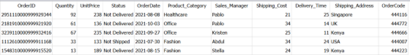
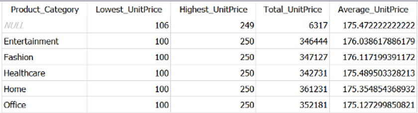
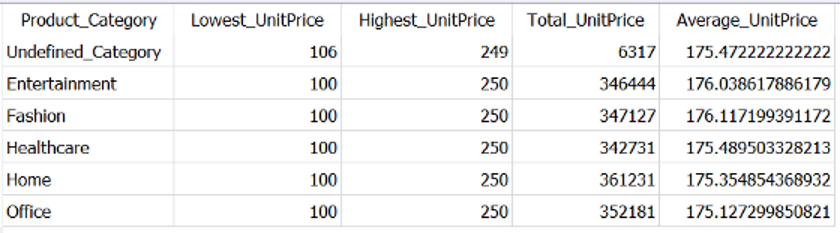
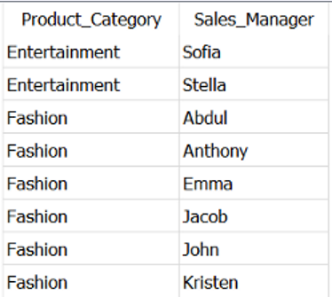
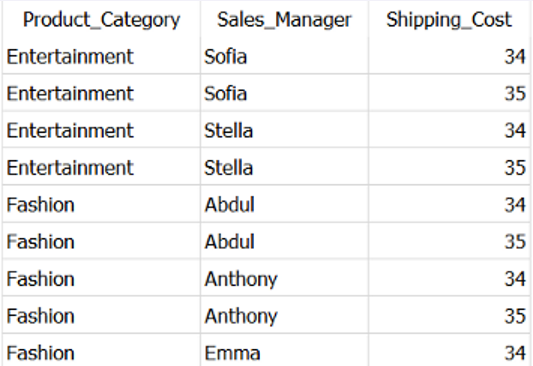

Below is a comprehensive rewrite of the original article. All information has been retained, but the wording and flow have been adjusted for clarity and uniqueness.

---

# 5 Practical SQL Examples to Master SQL GROUP BY

**How to Use GROUP BY Clause in SQL | Towards Data Science**  
**From simple to more advanced GROUP BY scenarios, all under 10 minutes**

---

## Introduction: GROUP BY in SQL, Explained

SQL (Structured Query Language) is a widely used tool for retrieving and transforming data stored in relational databases. A key aspect of data transformation is aggregation, and to properly aggregate data, understanding the `GROUP BY` clause is essential.  

In SQL, the `GROUP BY` clause is typically used alongside aggregate functions such as `SUM()`, `MIN()`, `MAX()`, `AVG()`, and `COUNT()`. When you apply these aggregate functions to a column, the results represent the calculated value for that particular group of rows.  

This article provides five practical examples of how to use the `GROUP BY` clause in SQL queries. By the end of these examples, you’ll be able to apply the `GROUP BY` clause in a variety of scenarios with confidence.  

### Article Outline

 in- [5 Practical SQL Examples to Master SQL GROUP BY](#5-practical-sql-examples-to-master-sql-group-by)
  - [Introduction: GROUP BY in SQL, Explained](#introduction-group-by-in-sql-explained)
    - [Article Outline](#article-outline)
    - [Dataset and Setup](#dataset-and-setup)
  - [1. GROUP BY with Aggregate Functions](#1-group-by-with-aggregate-functions)
  - [2. GROUP BY without Aggregate Functions](#2-group-by-without-aggregate-functions)
  - [3. GROUP BY with HAVING](#3-group-by-with-having)
  - [4. GROUP BY with ORDER BY](#4-group-by-with-order-by)
  - [5. GROUP BY with WHERE, HAVING, and ORDER BY](#5-group-by-with-where-having-and-order-by)
  - [Conclusion](#conclusion)

---

### Dataset and Setup

For demonstration, we’re using SQLite DB Browser with a self-created [Sales Data](https://github.com/17rsuraj/data-curious/blob/master/TowardsDataScience/Dummy_Sales_Data_v1.csv) generated using the [Faker](https://towardsdatascience.com/faker-an-amazing-and-insanely-useful-python-library-b313a60bdabf) Python library. This dataset, available on [GitHub](https://github.com/17rsuraj/data-curious/blob/master/TowardsDataScience/Dummy_Sales_Data_v1.csv) under the [MIT License](https://github.com/17rsuraj/data-curious/blob/master/LICENSE.md), has 9999 rows and 11 columns, structured as shown below:


*Dummy sales dataset | Image by Author*

Before proceeding, it’s important to remember this rule when using `GROUP BY`:

> **When you use `GROUP BY` in a SQL query, each column in the `SELECT` statement must appear either in the `GROUP BY` clause or within an aggregate function.**

Let’s start with the simplest example and gradually move to more advanced ones.

---

## 1. GROUP BY with Aggregate Functions

This is the most common usage scenario, where you apply an aggregate function to one or more columns. The `GROUP BY` clause groups rows based on the specified columns, and the aggregate function calculates a value for each group.

For instance, suppose we want to get a statistical summary of the `UnitPrice` for each `Product_Category`. We’ll use all aggregate functions in the example:

```sql
SELECT 
    Product_Category,
    MIN(UnitPrice) AS Lowest_UnitPrice,
    MAX(UnitPrice) AS Highest_UnitPrice,
    SUM(UnitPrice) AS Total_UnitPrice,
    AVG(UnitPrice) AS Average_UnitPrice
FROM Dummy_Sales_Data_v1
GROUP BY Product_Category;
```



*Data Aggregation in SQL | Image by Author*

- We’ve used two columns: **Product_Category** and **UnitPrice**.  
- **Product_Category** is in the `SELECT` list and is also the column we’re grouping by.  
- **UnitPrice** is used with aggregate functions (`MIN`, `MAX`, `SUM`, `AVG`).  

Notice the first row has `NULL` for `Product_Category`. According to the [Microsoft documentation](https://docs.microsoft.com/en-us/sql/t-sql/queries/select-group-by-transact-sql?view=sql-server-ver16):

> “If a grouping column contains NULL values, all NULL values are considered equal and they are collected into a single group.”

By default, these `NULL` values appear at the top when sorting in ascending order. If you want to replace `NULL` with a more meaningful label in the output, you can use the `COALESCE` function:

```sql
SELECT 
    COALESCE(Product_Category, 'Undefined_Category') AS Product_Category,
    MIN(UnitPrice) AS Lowest_UnitPrice,
    MAX(UnitPrice) AS Highest_UnitPrice,
    SUM(UnitPrice) AS Total_UnitPrice,
    AVG(UnitPrice) AS Average_UnitPrice
FROM Dummy_Sales_Data_v1
GROUP BY Product_Category;
```




*Handling NULL Values in GROUP BY | Image by Author*

> **Important:** Although we used `COALESCE` on the `Product_Category` column, we did not aggregate this column. Thus, `Product_Category` still needs to be listed in the `GROUP BY` clause.

You can apply as many aggregate functions as you need, as long as you ensure that non-aggregated columns appear in the `GROUP BY` clause.

---

## 2. GROUP BY without Aggregate Functions

While `GROUP BY` is usually used with aggregate functions, you can also use it **without** them to find unique rows.  

For example, let’s say you want to retrieve all **unique combinations** of `Sales_Manager` and `Product_Category`:

```sql
SELECT 
    Product_Category,
    Sales_Manager
FROM Dummy_Sales_Data_v1
GROUP BY 
    Product_Category,
    Sales_Manager;
```


*Using GROUP BY without Aggregate Functions | Image by Author*

Some might note that you can achieve the same result using the `DISTINCT` keyword. However, there are two main reasons why `GROUP BY` can be preferable:

1. **Sorting**: Results from `GROUP BY` are automatically returned in ascending order based on the grouped columns.  
2. **Performance**: When dealing with very large datasets (millions of rows) and/or multiple `JOIN`s, `DISTINCT` can be expensive. In contrast, `GROUP BY` is often more efficient in such cases.

You can read more about interesting use cases of `GROUP BY` in other articles, but let’s move on to filtering grouped results.

---

## 3. GROUP BY with HAVING

In SQL, `HAVING` works similarly to `WHERE`, but it filters groups rather than individual rows.  

**Example 1: Filtering on Non-Aggregated Columns**  
Imagine you want to get unique records of `Product_Category`, `Sales_Manager`, and `Shipping_Cost` where the `Shipping_Cost` is greater than or equal to 34. You could do this using either `WHERE` or `HAVING`:

```sql
-- Using WHERE clause
SELECT 
    Product_Category, 
    Sales_Manager,
    Shipping_Cost
FROM Dummy_Sales_Data_v1
WHERE Shipping_Cost >= 34
GROUP BY 
    Product_Category, 
    Sales_Manager, 
    Shipping_Cost;

-- Using HAVING clause
SELECT 
    Product_Category,
    Sales_Manager,
    Shipping_Cost
FROM Dummy_Sales_Data_v1
GROUP BY 
    Product_Category,
    Sales_Manager,
    Shipping_Cost
HAVING Shipping_Cost >= 34;
```


*Same output from WHERE and HAVING in GROUP BY | Image by Author*

Both queries give the same result, but they operate differently:

- `WHERE` is applied **before** `GROUP BY`, so it checks the entire dataset for `Shipping_Cost >= 34`.  
- `HAVING` is applied **after** `GROUP BY`, so it filters already grouped rows, making it potentially more efficient.

**Example 2: Filtering on Aggregated Columns**  
Suppose you want each combination of `Product_Category` and `Sales_Manager` where the **total** `Shipping_Cost` is more than 6000. In this case, you need to filter on `SUM(Shipping_Cost)`, which cannot be done in the `WHERE` clause. Instead, you use `HAVING`:

```sql
SELECT 
    Product_Category,
    Sales_Manager,
    SUM(Shipping_Cost) AS Total_Cost
FROM Dummy_Sales_Data_v1
GROUP BY 
    Product_Category,
    Sales_Manager
HAVING SUM(Shipping_Cost) > 6000;
```

*(Image:6.png)*  
*Using HAVING with Aggregated Columns | Image by Author*

Because `Shipping_Cost` is aggregated, it is **not** listed in the `GROUP BY` clause; only `Product_Category` and `Sales_Manager` are. Once the rows are grouped, `HAVING` checks whether each group’s total cost exceeds 6000.

> **Note:** Because `HAVING` is evaluated before the `SELECT` list is finalized, you cannot directly use column aliases (like `Total_Cost`) within the `HAVING` clause.

---

## 4. GROUP BY with ORDER BY

By default, `GROUP BY` orders records in ascending (alphabetical) order according to the grouped columns. However, if you want to sort by your aggregated columns or in a specific sequence, you use `ORDER BY`.

Continuing the previous example, let’s say you want to sort by `Total_Cost` in descending order:

```sql
SELECT 
    Product_Category,
    Sales_Manager,
    SUM(Shipping_Cost) AS Total_Cost
FROM Dummy_Sales_Data_v1
GROUP BY 
    Product_Category,
    Sales_Manager
ORDER BY 
    Total_Cost DESC;
```

*(Image:7.png)*  
*Using ORDER BY DESC on an Aggregated Column | Image by Author*

Here, `Product_Category` and `Sales_Manager` are no longer in ascending order because we have not specified them in the `ORDER BY` clause. If you want those columns in ascending order while keeping `Total_Cost` in descending order, list them all in `ORDER BY` with the desired sorting:

```sql
SELECT 
    Product_Category,
    Sales_Manager,
    SUM(Shipping_Cost) AS Total_Cost
FROM Dummy_Sales_Data_v1
GROUP BY 
    Product_Category,
    Sales_Manager
ORDER BY 
    Product_Category,
    Sales_Manager,
    Total_Cost DESC;
```

*(Image:8.png)*  
*Sorting by Multiple Columns in Different Orders | Image by Author*

This query will display:

- `Product_Category` and `Sales_Manager` in ascending order.  
- `Total_Cost` in descending order.

> **Key Takeaway:** You can mix ascending and descending orders for different columns in the same `ORDER BY` clause. The order in which you list these columns in the clause changes the final sorting.

---

## 5. GROUP BY with WHERE, HAVING, and ORDER BY

To understand how all these clauses work together, consider this scenario:

- You want to **only** look at orders that are **Not Delivered** (`Status = 'Not Delivered'`).  
- You also want to find **each** combination of `Sales_Manager` and `Product_Category` where the **total** `Shipping_Cost` in that category is more than 1600.  

Follow these steps:

1. **Filter records by non-aggregated column**: Use `WHERE Status = 'Not Delivered'`.  
2. **Group the data**: Use `GROUP BY Sales_Manager, Product_Category`.  
3. **Filter the groups by aggregated column**: Use `HAVING SUM(Shipping_Cost) > 1600`.  

The resulting query:

```sql
SELECT 
    Sales_Manager,
    Product_Category,
    SUM(Shipping_Cost) AS Total_Cost
FROM Dummy_Sales_Data_v1
WHERE Status = 'Not Delivered'
GROUP BY 
    Sales_Manager,
    Product_Category
HAVING SUM(Shipping_Cost) > 1600;
```

*(Image:9.png)*  
*Combining WHERE, GROUP BY, and HAVING | Image by Author*

The result shows unique `Sales_Manager` and `Product_Category` pairs that meet both conditions. Notice how the rows appear in ascending order for both columns in the final output—this is the default ordering behavior of `GROUP BY`.

---

## Conclusion

That covers the `GROUP BY` clause in SQL with five practical examples:

1. **GROUP BY with Aggregate Functions**  
2. **GROUP BY without Aggregate Functions**  
3. **GROUP BY with HAVING**  
4. **GROUP BY with ORDER BY**  
5. **GROUP BY with WHERE, HAVING, and ORDER BY**

Key points to remember:

- **When using `GROUP BY`, each column in the `SELECT` must either be aggregated or listed in the `GROUP BY`.**  
- **`HAVING` is used to filter groups (based on aggregate conditions) while `WHERE` is used to filter individual rows.**  
- **You can sort grouped results using `ORDER BY` and can apply multiple columns in both ascending and descending orders.**  

With these examples in hand, you should have a solid grasp on how to effectively use `GROUP BY` in a variety of real-world data analysis scenarios. Happy querying!